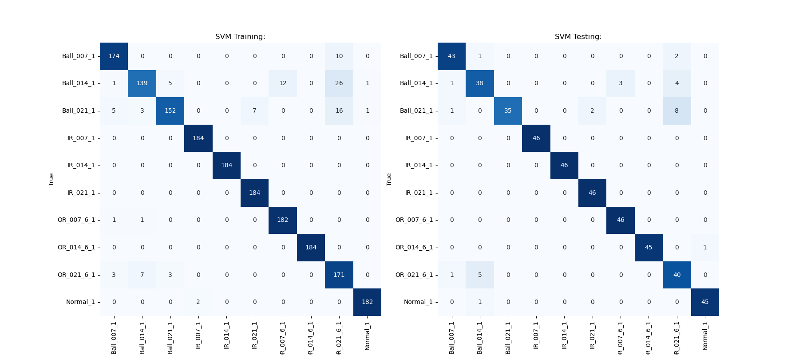
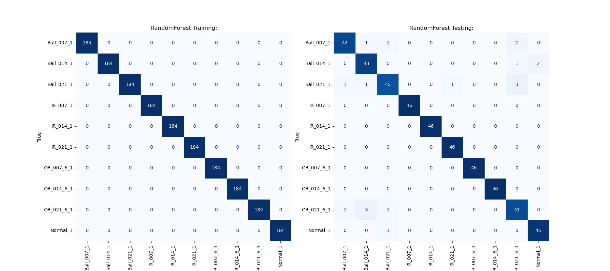
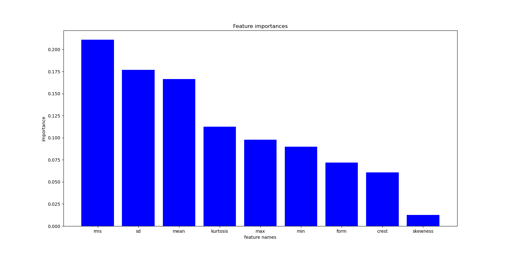
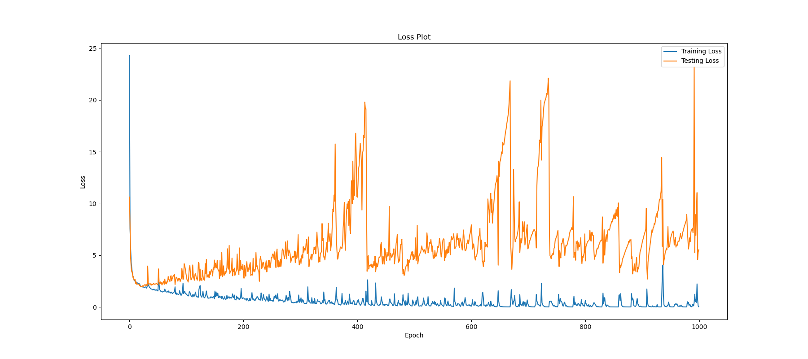

#  深度學習 作業三

## Abstract

This homework utilize SVM (Support Vector Machine), RandomForest, and custom Neural network to predict the bearing faults.

## Author 

Team Name: "Team FianCatto"

(Referring to a chess strategy: Fianchetto)

Member:

A1085125 洪祐鈞 

(Yes, there's only 1 person one the team and the professor is asking for a team name...)

## Few question to be answered at the first

Basically answering the professors requirement directly to save some time.

### What is the problem that you will be investigating? Why is it interesting?

Real life industrial problem is intriguing to me. Also it seems like its the most straight forward topic to investigate.

But actually I just choose the topic by elimination:

- I had a huge pain dealing with virtual try-on or image generation since my gpu memory is only 4 gigabyte, also kaggle would shut down your connection in 12 hours. I do not have good 

- I have no familiarity in stock market, if I were to do this experiment, single LSTM model would not just work. Also it might need to do a lot of web scraping in the process to get the data you need. It might be the most interesting topic since I might even do content analysis on stock news. However the topic is so big that a single person like me cannot handle.

- I have done pose estimation on jetson nano using ```Pose-ResNet18-Body``` when I was helping lab senior last year. I don't want to do the same task again. It was an interesting topic though.

- Heart disease prediction is quite similar to bearing fault classification. But I love doing task with multiple classification instead of binary classification.

### What are the challenges of this project?

Conversion of the dataset to feed to my own model took me some time, I was not familiar with data pre-processing. 
    
Also knowing why my model works is still a mystery to me.

### What dataset are you using? How do you plan to collect it?

CWRU dataset on [kaggle](https://www.kaggle.com/datasets/brjapon/cwru-bearing-datasets), the csv dataset is relatively easy to process.

Not sure what does professor mean by "collect", maybe he was referring to the stock market exclusively, since the dataset of the task I did was relatively simple.

For the data preprocessing, I actually did standardize the CRWU dataset.

### What method or algorithm are you proposing? If there are existing implementations, will you use them and how? How do you plan to improve or modify such implementations?

Basically the task is extremely simple, the goal of the task is just extract 9 features and output 10 classification from 2300 data. Hence here we will compare the methods as following:

- Existing method:
    - Random Forest
    - Support Vector Machine
    - [FaultNet](https://arxiv.org/abs/2010.02146)

- Custom method:
    - Custom neural network that with only linear layers and relu activation layers.

Expectation:

I expect Neural Network approach would gain better result. And see if without 2D convolution layer proposed in the FaultNet would make more sense and make good prediction.

### What reading will you examine to provide context and background? If relevant, what papers do you refer to?

Reading: [FaultNet](https://arxiv.org/abs/2010.02146)

There's a interesting story behind it: 

When I saw FaultNet treat the data as a 2D data and utillze 2D convolution to classfy the bearing faults. It does not make any sense to me, since for what I've recall: 2D Convolution extract the neiborhood information with kernel sliding. 

The source code of the paper implementation basically sample 1600 data and shape to 40*40 data and do the convolution. It just sound extremely bizarre to me since the neiborhood data should be treated like it's independant to each other.

But their's accuracy is significant in the paper is better than me, so maybe I am wrong.

### How will you evaluate your results? Qualitatively, what kind of results do you expect (e.g. plots or figures)? Quantitatively, what kind of analysis will you use to evaluate and/or compare your results (e.g. what performance metrics or statistical tests)?

The evaluation and metrics will be shown later at the result section.

## Environment

- EndeavourOS (Cassini Nova) (Arch linux distro)
- Miniconda 23.1.1
- ASUS aspire-7 (A715-51G) laptop.
- CPU: intel i7-1260p
- GPU: NVIDIA GeForce RTX 3050 4GB Laptop GPU
- Python 3.11.3
- For python module version, please refer to requirements.txt

## How to Run?

```=bash
python svm.py
python random_forest.py
python neural network.py
```

3 python file represent 3 methods, after running the code, folder named with the method will generate result, plot and model checkpoint. Specifically:

```
svm
├── model.joblib
├── result.json
└── SVMconfusion_matrix.png

random_forest
├── feature_importance.png
├── model.joblib
├── RandomForestconfusion_matrix.png
└── result.json

neural_network
├── best_model.pth
├── loss_plot.png
├── NeuralNetworkconfusion_matrix.png
└── result.json
```

## Method and Result:

The goal of the task is to based on the given input as the factor that may cause the bearing fault, and predict whether it would occur bearing fault, and if it does, where  the fault would located on the bearing.

Basically all data is from ```feature_time_48k_2048_load_1.csv```, which can be downloaded on [kaggle](https://www.kaggle.com/datasets/brjapon/cwru-bearing-datasets)

The data is first read from csv file and interpreted by pandas dataframe, then 9 features were normalized respecively. After that, it feeds to the model and output 10 classification.

Features:
- max (maximum)
- min (minimum)
- mean 
- sd (standard deviation)
- rms
- skewness
- kurtosis
- crest (crest factor)
- form (form factor)

Fault type
location: ball, inner race, outer race.
diameter of defects: 0.007, 0.014, 0.021 inches

Classfication:
- Ball_007_1
- Ball_014_1
- Ball_021_1
- IR_007_1
- IR_014_1
- IR_021_1
- OR_007_6_1
- OR_014_6_1
- OR_021_6_1
- Normal_1

### SVM

SVM (Support Vector Machine) is a machine learning technique that draws a line to separate different groups of data points. It helps classify things into different categories based on their features. It could also be used in non-linear classification.

The parameter basically is preset, I cannot get any better result with my own tuning.

#### Result:

The test accuracy is: 93.48%, the more fined-grained result is as following:

```
{
    "train": {
        "Ball_007_1": {
            "precision": 0.9456521739130435,
            "recall": 0.9456521739130435,
            "f1-score": 0.9456521739130435,
            "support": 184
        },
        "Ball_014_1": {
            "precision": 0.9266666666666666,
            "recall": 0.7554347826086957,
            "f1-score": 0.8323353293413174,
            "support": 184
        },
        "Ball_021_1": {
            "precision": 0.95,
            "recall": 0.8260869565217391,
            "f1-score": 0.8837209302325583,
            "support": 184
        },
        "IR_007_1": {
            "precision": 0.989247311827957,
            "recall": 1.0,
            "f1-score": 0.9945945945945946,
            "support": 184
        },
        "IR_014_1": {
            "precision": 1.0,
            "recall": 1.0,
            "f1-score": 1.0,
            "support": 184
        },
        "IR_021_1": {
            "precision": 0.9633507853403142,
            "recall": 1.0,
            "f1-score": 0.9813333333333333,
            "support": 184
        },
        "Normal_1": {
            "precision": 0.9381443298969072,
            "recall": 0.9891304347826086,
            "f1-score": 0.9629629629629629,
            "support": 184
        },
        "OR_007_6_1": {
            "precision": 1.0,
            "recall": 1.0,
            "f1-score": 1.0,
            "support": 184
        },
        "OR_014_6_1": {
            "precision": 0.7668161434977578,
            "recall": 0.9293478260869565,
            "f1-score": 0.8402948402948404,
            "support": 184
        },
        "OR_021_6_1": {
            "precision": 0.9891304347826086,
            "recall": 0.9891304347826086,
            "f1-score": 0.9891304347826086,
            "support": 184
        },
        "accuracy": 0.9434782608695652,
        "macro avg": {
            "precision": 0.9469007845925255,
            "recall": 0.9434782608695652,
            "f1-score": 0.943002459945526,
            "support": 1840
        },
        "weighted avg": {
            "precision": 0.9469007845925255,
            "recall": 0.9434782608695652,
            "f1-score": 0.9430024599455259,
            "support": 1840
        }
    },
    "test": {
        "Ball_007_1": {
            "precision": 0.9347826086956522,
            "recall": 0.9347826086956522,
            "f1-score": 0.9347826086956522,
            "support": 46
        },
        "Ball_014_1": {
            "precision": 0.8444444444444444,
            "recall": 0.8260869565217391,
            "f1-score": 0.8351648351648352,
            "support": 46
        },
        "Ball_021_1": {
            "precision": 1.0,
            "recall": 0.7608695652173914,
            "f1-score": 0.8641975308641976,
            "support": 46
        },
        "IR_007_1": {
            "precision": 1.0,
            "recall": 1.0,
            "f1-score": 1.0,
            "support": 46
        },
        "IR_014_1": {
            "precision": 1.0,
            "recall": 1.0,
            "f1-score": 1.0,
            "support": 46
        },
        "IR_021_1": {
            "precision": 0.9583333333333334,
            "recall": 1.0,
            "f1-score": 0.9787234042553191,
            "support": 46
        },
        "Normal_1": {
            "precision": 0.9387755102040817,
            "recall": 1.0,
            "f1-score": 0.968421052631579,
            "support": 46
        },
        "OR_007_6_1": {
            "precision": 1.0,
            "recall": 0.9782608695652174,
            "f1-score": 0.989010989010989,
            "support": 46
        },
        "OR_014_6_1": {
            "precision": 0.7407407407407407,
            "recall": 0.8695652173913043,
            "f1-score": 0.7999999999999999,
            "support": 46
        },
        "OR_021_6_1": {
            "precision": 0.9782608695652174,
            "recall": 0.9782608695652174,
            "f1-score": 0.9782608695652174,
            "support": 46
        },
        "accuracy": 0.9347826086956522,
        "macro avg": {
            "precision": 0.939533750698347,
            "recall": 0.9347826086956521,
            "f1-score": 0.9348561290187789,
            "support": 460
        },
        "weighted avg": {
            "precision": 0.939533750698347,
            "recall": 0.9347826086956522,
            "f1-score": 0.934856129018779,
            "support": 460
        }
    }
}
```

#### Cofusion matrix:



### Random Forest

Random forest is a machine learning method that combines multiple decision trees to make predictions to extract the classification.

For all method, it perform the best. The parameter is still preset.

#### Result

Test Accuracy: 95.89%, more fined-grained result is as follows.

```
{
    "train": {
        "Ball_007_1": {
            "precision": 1.0,
            "recall": 1.0,
            "f1-score": 1.0,
            "support": 184
        },
        "Ball_014_1": {
            "precision": 1.0,
            "recall": 1.0,
            "f1-score": 1.0,
            "support": 184
        },
        "Ball_021_1": {
            "precision": 1.0,
            "recall": 1.0,
            "f1-score": 1.0,
            "support": 184
        },
        "IR_007_1": {
            "precision": 1.0,
            "recall": 1.0,
            "f1-score": 1.0,
            "support": 184
        },
        "IR_014_1": {
            "precision": 1.0,
            "recall": 1.0,
            "f1-score": 1.0,
            "support": 184
        },
        "IR_021_1": {
            "precision": 1.0,
            "recall": 1.0,
            "f1-score": 1.0,
            "support": 184
        },
        "Normal_1": {
            "precision": 1.0,
            "recall": 1.0,
            "f1-score": 1.0,
            "support": 184
        },
        "OR_007_6_1": {
            "precision": 1.0,
            "recall": 1.0,
            "f1-score": 1.0,
            "support": 184
        },
        "OR_014_6_1": {
            "precision": 1.0,
            "recall": 1.0,
            "f1-score": 1.0,
            "support": 184
        },
        "OR_021_6_1": {
            "precision": 1.0,
            "recall": 1.0,
            "f1-score": 1.0,
            "support": 184
        },
        "accuracy": 1.0,
        "macro avg": {
            "precision": 1.0,
            "recall": 1.0,
            "f1-score": 1.0,
            "support": 1840
        },
        "weighted avg": {
            "precision": 1.0,
            "recall": 1.0,
            "f1-score": 1.0,
            "support": 1840
        }
    },
    "test": {
        "Ball_007_1": {
            "precision": 0.9545454545454546,
            "recall": 0.9130434782608695,
            "f1-score": 0.9333333333333332,
            "support": 46
        },
        "Ball_014_1": {
            "precision": 0.8958333333333334,
            "recall": 0.9347826086956522,
            "f1-score": 0.9148936170212766,
            "support": 46
        },
        "Ball_021_1": {
            "precision": 0.9302325581395349,
            "recall": 0.8695652173913043,
            "f1-score": 0.898876404494382,
            "support": 46
        },
        "IR_007_1": {
            "precision": 1.0,
            "recall": 1.0,
            "f1-score": 1.0,
            "support": 46
        },
        "IR_014_1": {
            "precision": 1.0,
            "recall": 1.0,
            "f1-score": 1.0,
            "support": 46
        },
        "IR_021_1": {
            "precision": 0.9787234042553191,
            "recall": 1.0,
            "f1-score": 0.989247311827957,
            "support": 46
        },
        "Normal_1": {
            "precision": 1.0,
            "recall": 1.0,
            "f1-score": 1.0,
            "support": 46
        },
        "OR_007_6_1": {
            "precision": 1.0,
            "recall": 1.0,
            "f1-score": 1.0,
            "support": 46
        },
        "OR_014_6_1": {
            "precision": 0.8723404255319149,
            "recall": 0.8913043478260869,
            "f1-score": 0.8817204301075269,
            "support": 46
        },
        "OR_021_6_1": {
            "precision": 0.9574468085106383,
            "recall": 0.9782608695652174,
            "f1-score": 0.967741935483871,
            "support": 46
        },
        "accuracy": 0.9586956521739131,
        "macro avg": {
            "precision": 0.9589121984316196,
            "recall": 0.9586956521739131,
            "f1-score": 0.9585813032268348,
            "support": 460
        },
        "weighted avg": {
            "precision": 0.9589121984316193,
            "recall": 0.9586956521739131,
            "f1-score": 0.9585813032268348,
            "support": 460
        }
    }
}
```

#### Confusion Matrix:



#### Feature Importance:

Also, since it's technically dicision tree, we can extract the importance of features respectively:

  

As the figure shown, the rms play the largest factor of bearing fault.

### Neural Network

Since the task itself is just a classifcation task, we can build a neural network to do the classification task:

The model architecture:

```
NN(
  (fc): Sequential(
    (0): Linear(in_features=9, out_features=36, bias=True)
    (1): ReLU(inplace=True)
    (2): Linear(in_features=36, out_features=144, bias=True)
    (3): ReLU(inplace=True)
    (4): Linear(in_features=144, out_features=288, bias=True)
    (5): ReLU(inplace=True)
    (6): Linear(in_features=288, out_features=64, bias=True)
    (7): ReLU(inplace=True)
    (8): Linear(in_features=64, out_features=32, bias=True)
    (9): ReLU(inplace=True)
    (10): Linear(in_features=32, out_features=16, bias=True)
    (11): ReLU(inplace=True)
    (12): Linear(in_features=16, out_features=10, bias=True)
  )
)
```

The parameters:

```
BATCH_SIZE = 16
NUM_EPOCHS = 1000
optimizer = torch.optim.Adam(model.parameters(), lr=0.001)
criterion = nn.CrossEntropyLoss()
```

Generally, I find deeper neural network have higher accuracy, but there's limit.

The trainning loss:



Here, I intentionally train my model with huge amount of epoches, and the validation loss seemed to have random glitch after overfitting. Which is interesting.

The best model is choosed from which gives the greatest validation accuracy.

#### Result:

Test Accuracy: 95.43%
The result is not better than random forest.

```
{
    "train": {
        "Ball_007_1": {
            "precision": 1.0,
            "recall": 1.0,
            "f1-score": 1.0,
            "support": 184
        },
        "Ball_014_1": {
            "precision": 1.0,
            "recall": 1.0,
            "f1-score": 1.0,
            "support": 184
        },
        "Ball_021_1": {
            "precision": 1.0,
            "recall": 1.0,
            "f1-score": 1.0,
            "support": 184
        },
        "IR_007_1": {
            "precision": 1.0,
            "recall": 1.0,
            "f1-score": 1.0,
            "support": 184
        },
        "IR_014_1": {
            "precision": 1.0,
            "recall": 1.0,
            "f1-score": 1.0,
            "support": 184
        },
        "IR_021_1": {
            "precision": 1.0,
            "recall": 1.0,
            "f1-score": 1.0,
            "support": 184
        },
        "Normal_1": {
            "precision": 1.0,
            "recall": 1.0,
            "f1-score": 1.0,
            "support": 184
        },
        "OR_007_6_1": {
            "precision": 1.0,
            "recall": 1.0,
            "f1-score": 1.0,
            "support": 184
        },
        "OR_014_6_1": {
            "precision": 1.0,
            "recall": 1.0,
            "f1-score": 1.0,
            "support": 184
        },
        "OR_021_6_1": {
            "precision": 1.0,
            "recall": 1.0,
            "f1-score": 1.0,
            "support": 184
        },
        "accuracy": 1.0,
        "macro avg": {
            "precision": 1.0,
            "recall": 1.0,
            "f1-score": 1.0,
            "support": 1840
        },
        "weighted avg": {
            "precision": 1.0,
            "recall": 1.0,
            "f1-score": 1.0,
            "support": 1840
        }
    },
    "test": {
        "Ball_007_1": {
            "precision": 0.8936170212765957,
            "recall": 0.9130434782608695,
            "f1-score": 0.9032258064516129,
            "support": 46
        },
        "Ball_014_1": {
            "precision": 0.9166666666666666,
            "recall": 0.9565217391304348,
            "f1-score": 0.9361702127659574,
            "support": 46
        },
        "Ball_021_1": {
            "precision": 0.8958333333333334,
            "recall": 0.9347826086956522,
            "f1-score": 0.9148936170212766,
            "support": 46
        },
        "IR_007_1": {
            "precision": 1.0,
            "recall": 1.0,
            "f1-score": 1.0,
            "support": 46
        },
        "IR_014_1": {
            "precision": 1.0,
            "recall": 1.0,
            "f1-score": 1.0,
            "support": 46
        },
        "IR_021_1": {
            "precision": 0.9787234042553191,
            "recall": 1.0,
            "f1-score": 0.989247311827957,
            "support": 46
        },
        "Normal_1": {
            "precision": 1.0,
            "recall": 0.9565217391304348,
            "f1-score": 0.9777777777777777,
            "support": 46
        },
        "OR_007_6_1": {
            "precision": 1.0,
            "recall": 1.0,
            "f1-score": 1.0,
            "support": 46
        },
        "OR_014_6_1": {
            "precision": 0.8604651162790697,
            "recall": 0.8043478260869565,
            "f1-score": 0.8314606741573034,
            "support": 46
        },
        "OR_021_6_1": {
            "precision": 1.0,
            "recall": 0.9782608695652174,
            "f1-score": 0.989010989010989,
            "support": 46
        },
        "accuracy": 0.9543478260869566,
        "macro avg": {
            "precision": 0.9545305541810984,
            "recall": 0.9543478260869565,
            "f1-score": 0.9541786389012874,
            "support": 460
        },
        "weighted avg": {
            "precision": 0.9545305541810984,
            "recall": 0.9543478260869566,
            "f1-score": 0.9541786389012873,
            "support": 460
        }
    }
}
```

## Conclusion

- For the accuracy, FaultNet>random forest>neural network>svm for my own implementation.
- 2300 data is not a big number, basically it can be done with simple machine learning technique without deep learning. Which still get good result in small amount of runtime.
- I think part of the reason that FaultNet outperform my implementation is that it separate the data to multiple channel like mean and median signal to get more imformation from the signal. But it still feel really bizzare to me that how did they even get the accuracy to 98.5%.